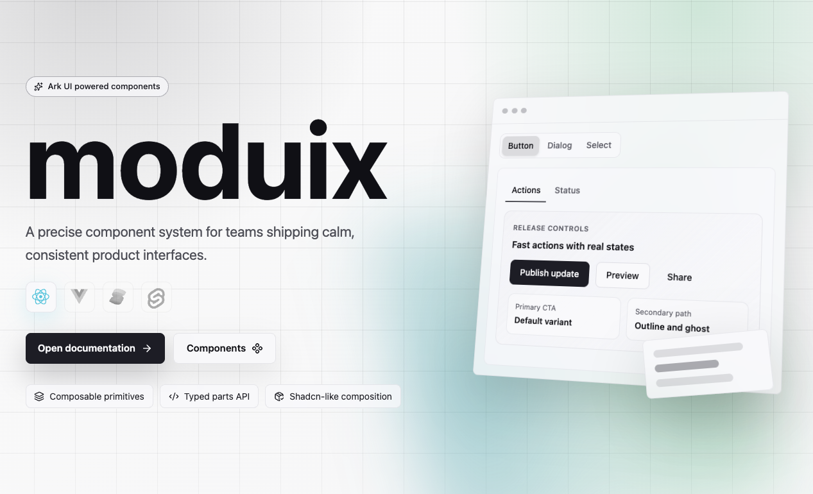

[](https://www.npmjs.com/package/moduix)
[](./LICENSE.md)
[](https://www.typescriptlang.org/)
[](https://turbo.build/)

Moduix is a ready-made React components for product interfaces. The library is built on top of Base UI primitives and follows a composition-first API strongly inspired by shadcn/ui: you assemble small named parts, keep behavior accessible, and customize styles through props, `className`, and CSS variables. Styles are written in native CSS with CSS Modules, so the package ships framework-agnostic component CSS without requiring a utility CSS runtime.

## Why This Exists

`moduix` started as an internal need: we were moving several company products to one shared component library and needed a consistent, composable foundation. It is not meant to compete with shadcn/ui - it is a pragmatic library shaped by real product work.

Another core idea is minimal dependencies. The library is built on Base UI primitives and ships native CSS, so teams can choose their own styling approach: native CSS, CSS Modules, Tailwind, or CSS-in-JS.

## Documentation

- Temp public docs: https://moduix.blinks44.workers.dev/
- Library README: `packages/ui/README.md`
- Docs app README: `apps/docs/README.md`

## Quick Usage

Install in your app:

```bash
npm install moduix @base-ui/react
```

Import styles once and use components:

```tsx
import 'moduix/style.css';
import { Button, Dialog, DialogContent, DialogTitle, DialogTrigger } from 'moduix';

export function Example() {
  return (
    <Dialog>
      <DialogTrigger render={<Button />}>Open dialog</DialogTrigger>
      <DialogContent>
        <DialogTitle>Project settings</DialogTitle>
      </DialogContent>
    </Dialog>
  );
}
```

## Repository Quick Start

From the monorepo root:

```bash
npm install
npm run build:ui
npm run dev
```

## Acknowledgements

This project could not exist without the work of these teams and communities:

- [Base UI](https://base-ui.com/) for the accessible React primitives that power the components.
- [shadcn/ui](https://ui.shadcn.com/) for the API inspiration and the culture of practical,
  readable component composition.
- [Tailwind CSS](https://tailwindcss.com/) for the reset.css implementation.
- [Fumadocs](https://fumadocs.dev/) for the documentation foundation.
- [TanStack](https://tanstack.com/) for the application tooling used by the docs.
- [Voidzero](https://voidzero.dev/) for awesome JS tools