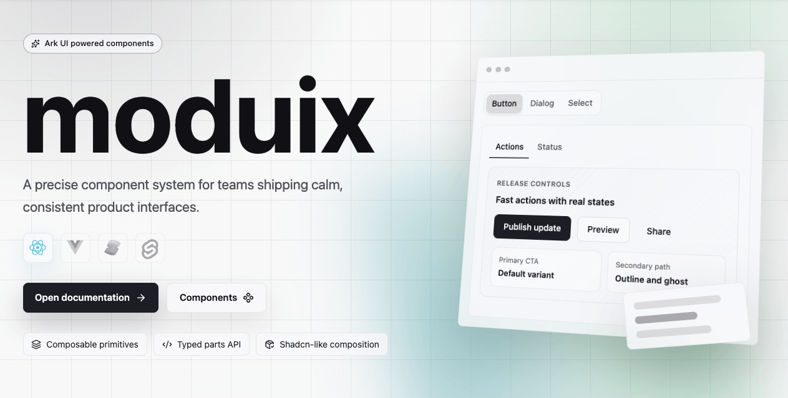

[](https://www.npmjs.com/package/@moduix/react)
[](./LICENSE.md)
[](https://www.typescriptlang.org/)

# moduix

Polished React components for product interfaces, built on
[Ark UI](https://ark-ui.com/) and styled with native CSS.

moduix pairs Ark's accessible interaction model with shadcn-inspired clarity: calm defaults,
explicit composition, a token-first theme contract, and a hosted registry when you want to own the
source. Use it as the `@moduix/react` package or copy selected components into your application with
the `shadcn` CLI.

[Documentation](https://moduix.dev/) ·
[Quick start](https://moduix.dev/docs/quick-start) ·
[Components](https://moduix.dev/docs/components) ·
[npm](https://www.npmjs.com/package/@moduix/react)

## Why moduix

- **Ark-backed behavior.** Complex interaction, keyboard support, state, and composition stay close
  to Ark UI instead of being reimplemented in a styled wrapper.
- **Polished defaults.** Components share a compact visual rhythm, predictable states, and a
  consistent focus-ring language.
- **Token-first CSS.** Colors, typography, spacing, radii, sizes, focus geometry, motion, shadows,
  and component aliases are regular CSS custom properties.
- **Composable APIs.** Named parts keep important structure visible and leave room for product-level
  composition.
- **Two ownership models.** Choose package-managed updates or source ownership through the hosted
  shadcn registry.
- **Small UI runtime.** moduix uses Ark UI as its primitive layer and does not require a styling
  framework.

## Choose an Ownership Model

Start with the npm package for the shortest setup. Use the registry when direct source ownership is
a project requirement.

| Workflow                   | Imports                 | Best fit                                                                |
| -------------------------- | ----------------------- | ----------------------------------------------------------------------- |
| npm package                | `@moduix/react`         | Package-managed updates and minimal application-owned infrastructure.   |
| Copy-owned shadcn registry | `@/components/moduix/*` | Direct customization, local source review, and AI-assisted development. |

Both workflows use the same component contracts and design-token foundation.

## Package Quick Start

Install moduix and its Ark UI peer dependency in an existing React 18 or 19 application:

```bash
npm install @moduix/react @ark-ui/react
```

Import the required foundation stylesheet once:

```tsx
import '@moduix/react/style.css';
```

The optional reset is a separate entrypoint and must come first:

```tsx
import '@moduix/react/reset.css';
import '@moduix/react/style.css';
```

Then compose the components you need:

```tsx
import { Button, Dialog } from '@moduix/react';

export function Example() {
  return (
    <Dialog.Root>
      <Dialog.Trigger asChild>
        <Button>Open settings</Button>
      </Dialog.Trigger>
      <Dialog.Backdrop />
      <Dialog.Positioner>
        <Dialog.Content>
          <Dialog.Header>
            <Dialog.Title>Project settings</Dialog.Title>
            <Dialog.Description>Update how this workspace behaves.</Dialog.Description>
          </Dialog.Header>
          <Dialog.Footer>
            <Dialog.CloseTrigger asChild>
              <Button variant="outline">Done</Button>
            </Dialog.CloseTrigger>
          </Dialog.Footer>
        </Dialog.Content>
      </Dialog.Positioner>
    </Dialog.Root>
  );
}
```

`style.css` provides shared tokens and base styles. Component imports bring along their own CSS, so
unused component styles can stay out of the consuming bundle.

## Copy-Owned Quick Start

Initialize shadcn for your framework, register the moduix namespace, and add the components you
need:

```bash
npx shadcn@latest init
npx shadcn@latest registry add '@moduix-react=https://moduix.dev/r/react/{name}.json'
npx shadcn@latest add @moduix-react/button @moduix-react/dialog
```

Make sure the `@/*` alias resolves to `src/*` in TypeScript and your bundler. Generated component
files land under `src/components/moduix/*`; shared styles, icons, and utilities land under
`src/lib/moduix/*`.

Import the generated foundation stylesheet once:

```tsx
import '@/lib/moduix/styles/style.css';
```

See the [complete Quick Start](https://moduix.dev/docs/quick-start) for Vite and Rsbuild aliases,
registry inspection, dry runs, optional reset setup, and alternative package managers.

## Theming

The default visual rhythm uses `--size-md: 36px` for primary controls and `--size-sm: 32px` for
popup rows. Inputs, buttons, select and combobox triggers, date controls, pagination, and menu-like
items resolve through that shared scale.

Theme the system from broad decisions to narrow exceptions:

1. Override primitives such as `--primary`, `--radius`, `--spacing-2`, and `--size-md`.
2. Use shared family tokens such as `--popup-item-min-height` and `--focus-ring-width`.
3. Reach for component aliases such as `--input-height` only when one component should diverge.

```css
:root {
  --primary: oklch(0.52 0.18 145);
  --radius: 0.75rem;
  --size-md: 36px;
  --size-sm: 32px;
}
```

Components expose `className`, stable moduix `data-slot` hooks, and Ark `data-scope`,
`data-part`, and state attributes where the underlying primitive provides them.

Optional `dense`, `soft`, and `contrast` presets are shipped separately:

```tsx
import '@moduix/react/style.css';
import '@moduix/react/presets/soft.css';
```

```html
<html data-moduix-theme="soft"></html>
```

Read [Tokens](https://moduix.dev/docs/tokens) for the full hierarchy and
[Themes](https://moduix.dev/docs/themes) for preset and custom-theme workflows.

## Repository

| Path             | Purpose                                                        |
| ---------------- | -------------------------------------------------------------- |
| `packages/react` | Published React package and registry source files.             |
| `apps/docs`      | Documentation site, examples, and hosted registry artifacts.   |
| `registry`       | Source manifest used to build shadcn-compatible registry JSON. |

The workspace uses npm, Turborepo, oxlint, oxfmt, and Changesets.

```bash
npm install
npm run build:react
npm run dev
```

Before opening a pull request, run the repository checks in order:

```bash
npm run fmt:fix
npm run lint:check
npm run build:react
npm run tsc:check
```

Run `npm run build:registry` after changing registry-shipped React source.

## Acknowledgements

moduix is possible because of the work and ideas of these projects:

- [Ark UI](https://ark-ui.com/) for the accessible, state-machine-backed primitives that define the
  behavioral foundation.
- [Chakra UI](https://chakra-ui.com/) for Ark-aligned composition ergonomics and enduring
  design-system craft.
- [shadcn/ui](https://ui.shadcn.com/) for open-code distribution, beautiful defaults, and practical
  documentation.
- [UnoCSS](https://unocss.dev/) and [Tailwind CSS](https://tailwindcss.com/) for the foundations
  adapted by the optional reset.
- [Fumadocs](https://fumadocs.dev/) and [TanStack](https://tanstack.com/) for the documentation
  experience and application foundation.
- [VoidZero](https://voidzero.dev/) for the JavaScript tooling used throughout the workspace.

## Contributing

Contributions are welcome, especially focused component improvements, accessibility fixes, bug
reports, and documentation corrections. Keep package behavior, local component notes, public docs,
and registry output synchronized when a public contract changes.

See [AGENTS.md](./AGENTS.md) for repository conventions used by maintainers and coding agents.

## License

[MIT](./LICENSE.md)