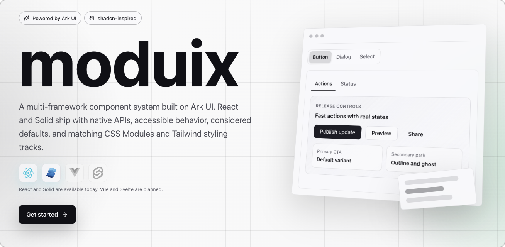

[](https://www.npmjs.com/package/@moduix/react)
[](./LICENSE.md)
[](https://www.typescriptlang.org/)

# moduix

Product-minded, multi-framework components built on [Ark UI](https://ark-ui.com/), with accessible
behavior, explicit composition, and CSS Modules at the core. React and Solid adapters ship today;
Vue and Svelte adapters are planned.

moduix combines Ark UI primitives with considered defaults and a shadcn-inspired ownership model.
Use the published package when you want managed updates, or add the component source
to your application through the hosted shadcn registry when you want to own it.

[Documentation](https://moduix.dev/) ·
[Quick start](https://moduix.dev/docs/quick-start) ·
[Components](https://moduix.dev/docs/components) ·
[Packages](#current-packages)

## Current packages

| Runtime | CSS Modules                                                    | Tailwind                                                                         |
| ------- | -------------------------------------------------------------- | -------------------------------------------------------------------------------- |
| React   | [`@moduix/react`](https://www.npmjs.com/package/@moduix/react) | [`@moduix/react-tailwind`](https://www.npmjs.com/package/@moduix/react-tailwind) |
| Solid   | [`@moduix/solid`](https://www.npmjs.com/package/@moduix/solid) | [`@moduix/solid-tailwind`](https://www.npmjs.com/package/@moduix/solid-tailwind) |

The package matrix grows with shipped adapters. Shared workflows and documentation are structured so Vue and Svelte can join without redefining the library around today's runtimes.

## Why moduix

- **Ark-backed behavior.** Dialogs, menus, inputs, and other complex interactions keep Ark UI's
  keyboard support, state management, form behavior, and accessibility semantics.
- **CSS Modules by default.** Component styles are ordinary CSS with locally scoped class names.
  There is no styling runtime and no Tailwind requirement.
- **Composable APIs.** Components expose the useful parts of their anatomy without hiding the
  primitive structure needed for product-specific UI.
- **A predictable styling contract.** Shared tokens, `className`, stable `data-slot` hooks, and Ark
  state attributes give application CSS clear extension points.
- **Two ownership models.** Keep dependencies package-managed or copy component source into your
  application through the shadcn registry.

## Get started

The example below uses the React CSS Modules package. Choose the shipped framework, styling track,
and ownership model that matches your application in the [Quick start](https://moduix.dev/docs/quick-start).

### Use the published package

Install moduix and its Ark UI peer dependency:

```bash
pnpm add @moduix/react @ark-ui/react
```

Import the shared foundation stylesheet once in your application entry point:

```tsx
import '@moduix/react/style.css';
```

The reset is optional. If you use it, import it before the foundation stylesheet:

```tsx
import '@moduix/react/reset.css';
import '@moduix/react/style.css';
```

Then import component subpaths and compose the parts you need:

```tsx
import { Button } from '@moduix/react/button';
import { Dialog } from '@moduix/react/dialog';

export function Example() {
  return (
    <Dialog>
      <Dialog.Trigger asChild>
        <Button>Open settings</Button>
      </Dialog.Trigger>
      <Dialog.Backdrop />
      <Dialog.Positioner>
        <Dialog.Content>
          <Dialog.Header>
            <Dialog.Title>Project settings</Dialog.Title>
            <Dialog.Description>Update how this workspace behaves.</Dialog.Description>
          </Dialog.Header>
          <Dialog.Footer>
            <Dialog.CloseTrigger asChild>
              <Button variant="outline">Done</Button>
            </Dialog.CloseTrigger>
          </Dialog.Footer>
        </Dialog.Content>
      </Dialog.Positioner>
    </Dialog>
  );
}
```

`Dialog` is the recommended root component. `Dialog.Root` remains available when an explicit
namespace is useful, such as in anatomy documentation or a local abstraction.

### Own the source with the registry

Use the registry when a component should live in your repository and evolve with your product. Set
up `components.json` with the [Quick start](https://moduix.dev/docs/quick-start), then add only the
components you need:

```bash
pnpm dlx shadcn@latest add @moduix-react/button @moduix-react/dialog
```

The generated source includes the component, its CSS Module, and any required supporting files.
The registry preserves the same component contracts and design tokens as the published package. Your
`components.json` aliases determine the destination paths.

## Styling and theming

Component styles are bundled with their component imports. `style.css` supplies the shared tokens
and base layer styles, while each component keeps its own CSS Module. Start with the built-in
appearance, then customize deliberately:

- pass `className` to a root or named part for application-owned selectors;
- target stable moduix `data-slot` hooks or Ark state attributes for state-specific rules;
- override public CSS custom properties at the appropriate theme, semantic, or component layer.

You can also add an optional preset after `style.css` and activate it on the document root:

```tsx
import '@moduix/react/style.css';
import '@moduix/react/presets/soft.css';
```

```html
<html data-moduix-theme="soft"></html>
```

The available presets are `dense`, `soft`, and `contrast`. See [Themes](https://moduix.dev/docs/themes)
and [Tokens](https://moduix.dev/docs/tokens) for the complete customization model.

## Repository

| Path                            | Purpose                                                                  |
| ------------------------------- | ------------------------------------------------------------------------ |
| `packages/<framework>`          | Published framework-native CSS Modules adapters.                         |
| `packages/<framework>-tailwind` | Published framework-native Tailwind adapters.                            |
| `packages/foundation`           | Shared framework-neutral tokens, resets, presets, and animations.        |
| `playgrounds/<framework>*`      | Adapter playgrounds used for parity checks.                              |
| `website`                       | Documentation site, runnable examples, and generated registry artifacts. |

Install dependencies and run the documentation site locally:

```bash
pnpm install
pnpm run dev:docs
```

Before opening a pull request, run the repository checks:

```bash
pnpm run fmt:fix
pnpm run lint:check
pnpm run build:packages
pnpm run tsc:check
```

Run `pnpm run build:registry` after changing files shipped by the registry.

## Contributing

Contributions are welcome, especially focused component improvements, accessibility fixes, bug
reports, and documentation corrections. Keep public component behavior, local component notes,
documentation, and registry output synchronized when a public contract changes.

See [AGENTS.md](./AGENTS.md) for repository conventions.

## Acknowledgements

moduix is possible because of the work and ideas of these projects:

- [Ark UI](https://ark-ui.com/) for the accessible, state-machine-backed primitives that define the
  behavioral foundation.
- [Chakra UI](https://chakra-ui.com/) for Ark-aligned composition ergonomics and design-system
  craft.
- [shadcn/ui](https://ui.shadcn.com/) for open-code distribution, beautiful defaults, and a
  documentation style centered on practical ownership.
- [Lucide](https://lucide.dev/) for the open-source icon set used throughout the component library.
- [UnoCSS](https://unocss.dev/) and [Tailwind CSS](https://tailwindcss.com/) for the foundations
  adapted by the optional reset.
- [Rstack](https://rstack.rs/) for its Rust-based ecosystem: Rspress for documentation, Rslib for
  library builds, and Rstest for tests.
- [VoidZero](https://voidzero.dev/) for the JavaScript tooling used throughout the workspace.

## License

[MIT](./LICENSE.md)

Third-party licenses and attribution are listed in
[THIRD_PARTY_NOTICES.md](./THIRD_PARTY_NOTICES.md).