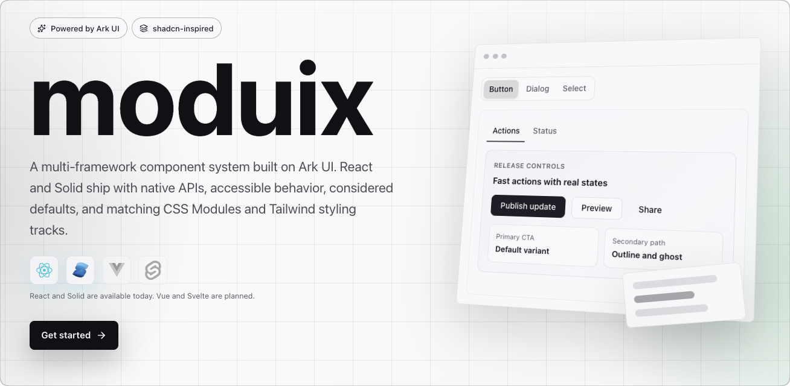

[](https://www.npmjs.com/package/@moduix/react)
[](./LICENSE.md)
[](https://www.npmjs.com/package/@moduix/react)
[](https://github.com/Blinks44/moduix/actions/workflows/verify.yml)

# moduix

**Accessible UI components for React, Solid, and Vue.** 80+ components and ready-made blocks built
on [Ark UI](https://ark-ui.com/), with the same API in every framework. Style them with CSS Modules
or Tailwind CSS v4, and install from npm or copy the source into your app with the shadcn CLI.

Ark UI handles keyboard interaction, focus, and accessibility semantics. Svelte support is planned.

Install a published package to receive updates through your package manager, or copy component
source into your application with the shadcn registry to edit it directly.

[Documentation](https://moduix.dev/) ·
[Quick start](https://moduix.dev/docs/quick-start) ·
[Components](https://moduix.dev/docs/components) ·
[Blocks](https://moduix.dev/blocks) ·
[Packages](#current-packages)

## Current packages

| Runtime | CSS Modules                                                    | Tailwind                                                                         |
| ------- | -------------------------------------------------------------- | -------------------------------------------------------------------------------- |
| React   | [`@moduix/react`](https://www.npmjs.com/package/@moduix/react) | [`@moduix/react-tailwind`](https://www.npmjs.com/package/@moduix/react-tailwind) |
| Solid   | [`@moduix/solid`](https://www.npmjs.com/package/@moduix/solid) | [`@moduix/solid-tailwind`](https://www.npmjs.com/package/@moduix/solid-tailwind) |
| Vue     | [`@moduix/vue`](https://www.npmjs.com/package/@moduix/vue)     | [`@moduix/vue-tailwind`](https://www.npmjs.com/package/@moduix/vue-tailwind)     |

## Why moduix

- **Ark-backed behavior.** Dialogs, menus, inputs, and other complex interactions keep Ark UI's
  keyboard support, state management, form behavior, and accessibility semantics.
- **The same component names across frameworks.** React, Solid, and Vue use flat exports such as
  `Dialog`, `DialogTrigger`, and `DialogContent`, with framework-native props and events.
- **Two styling paths.** Choose CSS Modules for ordinary, locally scoped component styles, or
  Tailwind CSS v4 for utility-first composition and overrides. Neither path adds a styling runtime.
- **Two ownership models.** Keep dependencies package-managed or copy component source into your
  application through the shadcn registry.

## Get started

The example below uses React with CSS Modules. [Quick start](https://moduix.dev/docs/quick-start)
covers every shipped framework, both styling tracks, and package or registry installation.

### Use the published package

Install moduix and its Ark UI peer dependency:

```bash
pnpm add @moduix/react @ark-ui/react
```

Import the reset and foundation once in your application entry point. If your application already
provides an equivalent reset, omit `reset.css`:

```tsx
import '@moduix/react/reset.css';
import '@moduix/react/style.css';
```

Import a component from its subpath:

```tsx
import { Button } from '@moduix/react/button';

export function Example() {
  return <Button>Continue</Button>;
}
```

There is no package-root export. Only the optional Chart integration requires `@tanstack/charts`.
The [package README](packages/react/README.md) shows how to compose a component from named parts.

### Own the source with the registry

Use the registry when a component should live in your repository and evolve with your product. Add
the moduix namespaces to `components.json` (the [Quick start](https://moduix.dev/docs/quick-start)
has the full file for each styling track):

```json
{
  "registries": {
    "@moduix-react": "https://moduix.dev/r/react/{name}.json",
    "@moduix-react-tailwind": "https://moduix.dev/r/react-tailwind/{name}.json"
  }
}
```

Then add only the components you need:

```bash
pnpm dlx shadcn@latest add @moduix-react/button @moduix-react/dialog
```

The generated source includes the component, its CSS Module, and any required supporting files.
The registry preserves the same component contracts and design tokens as the published package. Your
`components.json` aliases determine the destination paths.

The registry also installs [blocks](https://moduix.dev/blocks), including sign-in forms, a sidebar
dashboard, and a data table. Each block includes its source, a shared layout CSS Module, and the
required UI components. After the same registry setup, install a block with one command:

```bash
pnpm dlx shadcn@latest add @moduix-react/login-simple
```

Choose the matching framework and styling namespace, such as `@moduix-vue-tailwind/login-simple`.
Tailwind blocks use Tailwind UI components and the same layout CSS Module.

## Styling and theming

Pass `className` (React) or `class` (Solid and Vue) to a root or named part. CSS Modules packages
support ordinary CSS and component variables; Tailwind packages merge utility overrides with
`tailwind-merge`. Both tracks share the same design tokens and optional presets: `dense`, `soft`,
and `contrast`.

See [Styling](https://moduix.dev/docs/styling), [Themes](https://moduix.dev/docs/themes), and
[Tokens](https://moduix.dev/docs/tokens) for customization.

## Versioning

moduix follows semantic versioning. The 3.x API is stable: breaking changes ship only in major
versions, each with a migration guide, and deprecated APIs stay available until the next major. See
[Versioning and stability](https://moduix.dev/docs/updating#versioning-and-stability).

Comparing options? See [moduix vs shadcn/ui, Park UI, and Chakra UI](https://moduix.dev/docs/comparison).

## Contributing

Contributions are welcome, especially focused component improvements, accessibility fixes, bug
reports, and documentation corrections. Keep public component behavior, local component notes,
documentation, and registry output synchronized when a public contract changes.

See [CONTRIBUTING.md](./CONTRIBUTING.md) for the repository layout, local setup, and checks, and [AGENTS.md](./AGENTS.md) for
repository conventions. Security issues go through [SECURITY.md](./SECURITY.md).

## Acknowledgements

moduix is possible because of the work and ideas of these projects:

- [Ark UI](https://ark-ui.com/) for interaction primitives.
- [Chakra UI](https://chakra-ui.com/) for component composition and styling patterns.
- [shadcn/ui](https://ui.shadcn.com/) for source distribution through registries.
- [Lucide](https://lucide.dev/) for the open-source icon set used throughout the component library.
- [UnoCSS](https://unocss.dev/) and [Tailwind CSS](https://tailwindcss.com/) for the foundations
  adapted by the optional reset.
- [Rstack](https://rstack.rs/) for its Rust-based ecosystem: Rspress for documentation, Rslib for
  library builds, and Rstest for tests.
- [VoidZero](https://voidzero.dev/) for the JavaScript tooling used throughout the workspace.

## License

[MIT](./LICENSE.md)

Third-party licenses and attribution are listed in
[THIRD_PARTY_NOTICES.md](./THIRD_PARTY_NOTICES.md).